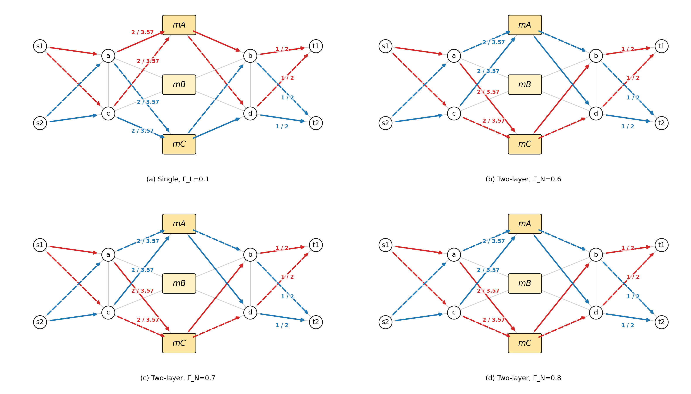
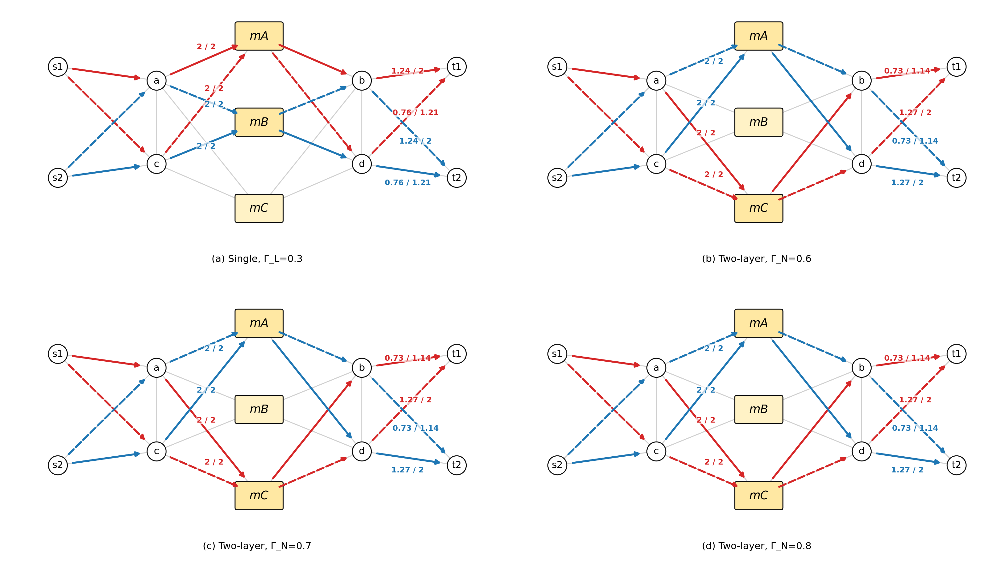
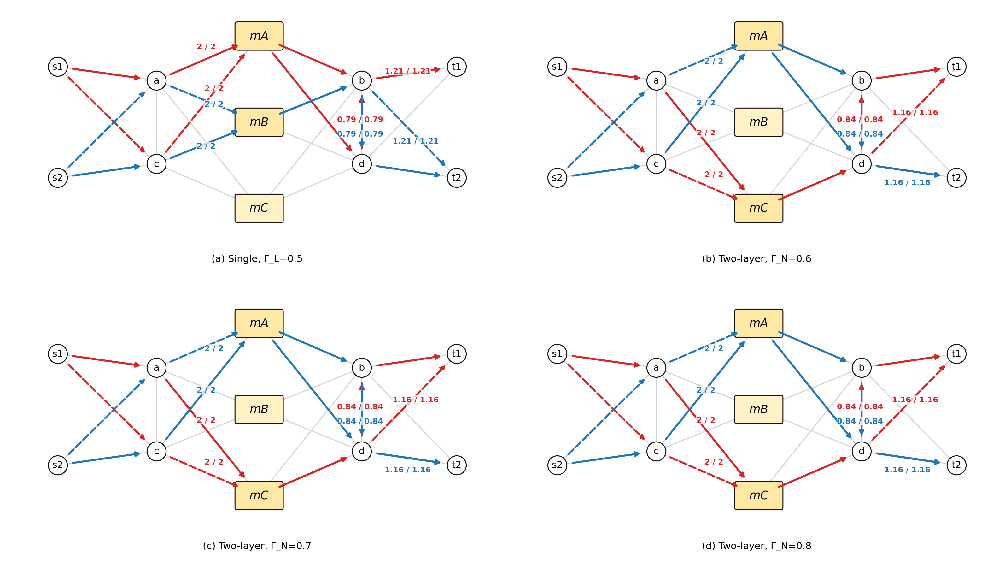

# 2026/6/4 讨论

> **任务安排：**
>
> **1、首先在小拓扑进行实验，分析使用平均分流双层模型的结果**：观察相同 CVaR 约束下，双层模型与单层模型的差异。

# 一、小拓扑实验

## 1.实验设置

### （1）小拓扑与任务设置

拓扑包含两个任务源节点、两个任务目的节点、三个候选计算节点以及若干转发节点。

- 任务 $i_1$：源节点 $s_1$，目的节点 $t_1$，输入需求 $b_{i_1}^{in}=4$，输出需求 $b_{i_1}^{out}=2$。
- 任务 $i_2$：源节点 $s_2$，目的节点 $t_2$，输入需求 $b_{i_2}^{in}=4$，输出需求 $b_{i_2}^{out}=2$。
- 候选计算节点：$m_A,m_B,m_C$。
- 链路容量统一设置为 5.0。

### （2）场景设置

故障场景暂时使用人为设定的故障场景集合。

### （3）模型形式

求解模型：（i）单层模型；（ii）双层模型。

风险控制方式采用 CVaR 约束。

注意在双层模型中，节点层CVaR是在平均分流策略下得到的，并非最终方案的真实CVaR。而链路层CVaR则是最终方案的真实CVaR。

因此，在小拓扑实验重点比较“相同最终真实 CVaR 约束 $\Gamma$ 下，单层模型与平均分流双层模型的结果差异”。在双层模型中，可以进一步调整节点层代理约束 $\Gamma_N$，观察其对节点放置和最终真实指标的影响。

## 2. 实验结果

### （1）节点放置、路径分配

相同最终真实 CVaR 约束 $\Gamma$ 下，单层模型与双层模型的差异：节点放置结果与路径流量分配结果如下。

这里展示三组：最终真实 CVaR 约束 $\Gamma_L=0.1,0.3,0.5$，双层模型节点层代理约束统一扫描 $\Gamma_N=0.6,0.7,0.8$。

---

**$\Gamma_L=0.1$ 时的工作状态对比：**

直观理解：

当双层模型节点层选择了与单层模型相同的放置时，双层模型的链路层与单层模型中关于路径流量分配的部分本质一致。因此，在相同放置、相同候选路径集合、相同最终真实 CVaR 约束 $\Gamma$ 下，路径流量分配方案是相同。

---

**$\Gamma_L=0.3$ 时的工作状态对比：**

---

**$\Gamma_L=0.5$ 时的工作状态对比：**

### （2）主要指标：CVaR、利用率、带宽开销与有效吞吐

三组 $\Gamma_L$ 下的主要结果。

| $\Gamma_L$ | 模型 | $\Gamma_N$ | CVaR | $U_{\mathrm{node}}^{\max}$ | $U_{\mathrm{link}}^{\max}$ | 总分配带宽 | Goodput |
| --- | --- | --- | ---: | ---: | ---: | ---: | ---: |
| 0.1 | 单层 | - | 0.100 | 1.000 | 0.714 | 22.286 | 11.862 |
| 0.1 | 双层 | 0.6 | 0.100 | 1.000 | 0.714 | 22.286 | 11.862 |
| 0.1 | 双层 | 0.7 | 0.100 | 1.000 | 0.714 | 22.286 | 11.862 |
| 0.1 | 双层 | 0.8 | 0.100 | 1.000 | 0.714 | 22.286 | 11.862 |
| 0.3 | 单层 | - | 0.300 | 1.000 | 0.400 | 14.429 | 11.460 |
| 0.3 | 双层 | 0.6 | 0.300 | 1.000 | 0.400 | 14.286 | 11.454 |
| 0.3 | 双层 | 0.7 | 0.300 | 1.000 | 0.400 | 14.286 | 11.454 |
| 0.3 | 双层 | 0.8 | 0.300 | 1.000 | 0.400 | 14.286 | 11.454 |
| 0.5 | 单层 | - | 0.500 | 1.000 | 0.400 | 12.000 | 11.052 |
| 0.5 | 双层 | 0.6 | 0.500 | 1.000 | 0.400 | 12.000 | 11.046 |
| 0.5 | 双层 | 0.7 | 0.500 | 1.000 | 0.400 | 12.000 | 11.046 |
| 0.5 | 双层 | 0.8 | 0.500 | 1.000 | 0.400 | 12.000 | 11.046 |

从表中可以看到：

1. 在 $\Gamma_L=0.1$ 时，单层与双层在 CVaR、最大链路利用率、总预留带宽、Goodput 等指标上完全一致，只是放置方案对称（由于需求相同，本质为等价放置）。
2. 在 $\Gamma_L=0.3$ 时，双层模型相较单层模型的总预留带宽略低（14.286 vs. 14.429），Goodput 也略低（11.454 vs. 11.460）。这说明双层模型得到的是一个与单层模型接近的可行方案。
3. 在 $\Gamma_L=0.5$ 时，单层与双层的总预留带宽均为 12.000，最大链路利用率也均为 0.400，但双层 Goodput 略低。这进一步说明，当最终真实 CVaR 约束较宽松时，资源利用率目标可以打平，但不同放置方案会在故障后的有效吞吐上产生细微差异。
4. 三组实验中，双层模型在 $\Gamma_N=0.6,0.7,0.8$ 下的最终结果保持一致，但$\Gamma_N=0.5$时，又找不到可行方案，说明在当前小拓扑设置下$\Gamma_N$对放置方案影响不明显 。后续若想观察 $\Gamma_N$ 的敏感性，可以继续尝试在更大拓扑中测试。

总体而言，在相同最终真实 CVaR 约束下，平均分流双层模型能够得到与单层联合模型接近的最终真实指标；二者的差异主要体现在节点放置以及由放置导致的路径流量分配变化。

# 后续安排——关于期末考试

6月10日将开始第一门期末考试，最后一门在6月25日上午，一共5门期末考试。

