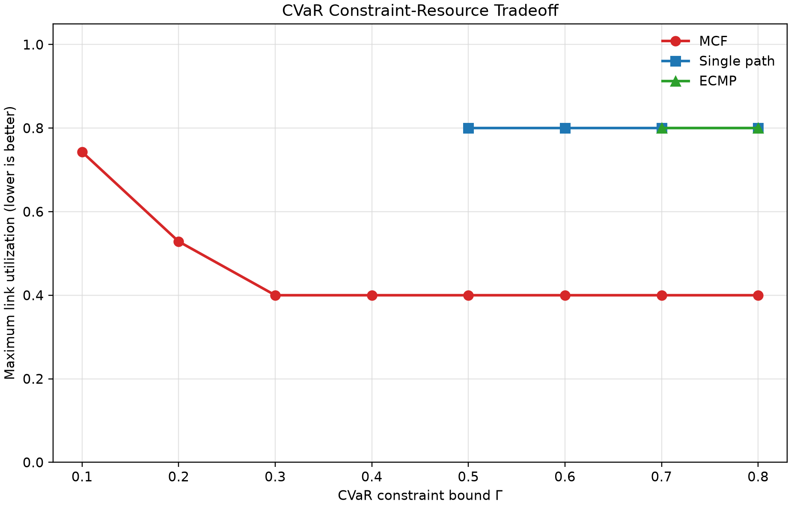

# 2026/7/16 讨论

> **任务安排：**
>
> 1. 在单层模型中补充三种带宽分配方案：多路径 MCF（已有）、单路径和 ECMP 均分，作为带宽分配 baseline。
> 1. 补充故障类型文件，分为：无故障、只有链路故障、只有节点故障、同时有链路故障和节点故障（已有），共四个文件


# 一、在单层模型中补充三种带宽分配方案


## 1.任务目标

原单层模型中的输入路径流量变量 $x_{i,m,p}^{\mathrm{in}}$ 和输出路径流量变量 $x_{i,m,q}^{\mathrm{out}}$ 为连续变量，同一任务可以在多条候选路径上进行不等比例分配。

接下来，构造变体作为 baseline：

- **单路径（Single path）**：每个任务的输入段和输出段分别只能选择一条候选路径；
- **ECMP 均分**：每个任务的带宽需求在对应的全部候选路径上严格均分；
- **多路径 MCF**：多路径分配方式，不要求均分。

三种方案通过 `routing_mode` 切换路径带宽约束。


## 2.约束实现

### （1）多路径 MCF

参数配置：

```json
"routing_mode": "mcf"
```

MCF 不增加额外的路径选择约束，保留建模章节中的输入、输出流量变量为非负连续变量。因此：

$$
\sum_{p\in\mathcal P_{i,m}^{\mathrm{in}}}
x_{i,m,p}^{\mathrm{in}}
\ge
b_i^{\mathrm{in}}y_{i,m},
\qquad
\forall i\in\mathcal J,\ m\in\mathcal M_i,
$$

$$
\sum_{q\in\mathcal P_{i,m}^{\mathrm{out}}}
x_{i,m,q}^{\mathrm{out}}
\ge
b_i^{\mathrm{out}}y_{i,m},
\qquad
\forall i\in\mathcal J,\ m\in\mathcal M_i.
$$

优化器可以同时使用多条候选路径，并自由决定各路径的分配比例。不同路径不要求均分；为了满足故障场景下的 CVaR 约束，总预留带宽也允许高于名义需求。这是当前提出方案中路由自由度最高的形式。

### （2）单路径

参数配置：

```json
"routing_mode": "single_path"
```

单路径模式需要新增输入、输出路径选择变量。为避免与建模章节中基本故障事件 $z\in Z$ 的符号冲突，这里使用 $a$ 表示路径是否被选择：

$$
a_{i,m,p}^{\mathrm{in}}\in\{0,1\},
\qquad
\forall i\in\mathcal J,\ m\in\mathcal M_i,\quad
p\in\mathcal P_{i,m}^{\mathrm{in}},
$$

$$
a_{i,m,q}^{\mathrm{out}}\in\{0,1\},
\qquad
\forall i\in\mathcal J,\ m\in\mathcal M_i,\quad
q\in\mathcal P_{i,m}^{\mathrm{out}}.
$$

其中，$a_{i,m,p}^{\mathrm{in}}=1$ 表示选择输入路径 $p$，$a_{i,m,q}^{\mathrm{out}}=1$ 表示选择输出路径 $q$。然后分别加入输入侧和输出侧单路径约束：

$$
\sum_{p\in\mathcal P_{i,m}^{\mathrm{in}}}
a_{i,m,p}^{\mathrm{in}}
=y_{i,m},
\qquad
\forall i\in\mathcal J,\ m\in\mathcal M_i,
$$

$$
x_{i,m,p}^{\mathrm{in}}
=b_i^{\mathrm{in}}a_{i,m,p}^{\mathrm{in}},
\qquad
\forall i\in\mathcal J,\ m\in\mathcal M_i,\quad
p\in\mathcal P_{i,m}^{\mathrm{in}},
$$

$$
\sum_{q\in\mathcal P_{i,m}^{\mathrm{out}}}
a_{i,m,q}^{\mathrm{out}}
=y_{i,m},
\qquad
\forall i\in\mathcal J,\ m\in\mathcal M_i,
$$

$$
x_{i,m,q}^{\mathrm{out}}
=b_i^{\mathrm{out}}a_{i,m,q}^{\mathrm{out}},
\qquad
\forall i\in\mathcal J,\ m\in\mathcal M_i,\quad
q\in\mathcal P_{i,m}^{\mathrm{out}}.
$$

当 $y_{i,m}=1$ 时，输入候选路径中恰好有一个 $a_{i,m,p}^{\mathrm{in}}=1$，输出候选路径中也恰好有一个 $a_{i,m,q}^{\mathrm{out}}=1$，并分别在所选路径上分配完整的输入、输出需求；其余路径流量均为 0。当 $y_{i,m}=0$ 时，对应的路径选择变量和流量变量均为 0。

这里的“单路径”是**输入段和输出段分别选一条路径**。即任务从源节点到计算节点选择一条输入路径，从计算节点到目的节点再选择一条输出路径。

### （3）ECMP 均分

参数配置：

```json
"routing_mode": "ecmp"
```

ECMP 沿用建模章节中的候选路径集合及其基数，不再引入新的路径数量符号。对每一条输入、输出候选路径分别加入等式约束：

$$
x_{i,m,p}^{\mathrm{in}}
=
\frac{b_i^{\mathrm{in}}}
{|\mathcal P_{i,m}^{\mathrm{in}}|}
y_{i,m},
\qquad
\forall i\in\mathcal J,\ m\in\mathcal M_i,\quad
p\in\mathcal P_{i,m}^{\mathrm{in}},
$$

$$
x_{i,m,q}^{\mathrm{out}}
=
\frac{b_i^{\mathrm{out}}}
{|\mathcal P_{i,m}^{\mathrm{out}}|}
y_{i,m},
\qquad
\forall i\in\mathcal J,\ m\in\mathcal M_i,\quad
q\in\mathcal P_{i,m}^{\mathrm{out}}.
$$

因此，被选中计算节点对应的所有候选路径均承担相同比例的需求。例如：输入输出均有 4 条候选路径；当前任务输入需求为 4、输出需求为 2，所以输入路径各分配 1，输出路径各分配 0.5。

ECMP 中路径流量已被等式完全固定，不能针对故障概率和链路拥塞调整分流比例，也不能额外预留超过名义需求的保护带宽。


### 注：三种约束的关系

三种模式可以理解为对同一组 $x_{i,m,p}^{\mathrm{in}}$ 和 $x_{i,m,q}^{\mathrm{out}}$ 施加不同程度的限制：

| 路由模式 | 路径变量形式 | 分配方式 | 是否允许超过名义需求 | 路由自由度 |
| --- | --- | --- | --- | --- |
| MCF | 连续流量变量 $x_{i,m,p}^{\mathrm{in}}$、$x_{i,m,q}^{\mathrm{out}}$ | 优化器决定，可不均分 | 允许 | 最高 |
| 单路径 | 连续流量变量 + 二元选择变量 $a_{i,m,p}^{\mathrm{in}}$、$a_{i,m,q}^{\mathrm{out}}$ | 输入、输出阶段各选择一条路径 | 不允许 | 较低 |
| ECMP | 连续流量变量 $x_{i,m,p}^{\mathrm{in}}$、$x_{i,m,q}^{\mathrm{out}}$ | 所有候选路径严格均分 | 不允许 | 最低 |


## 3.运行方式


### case1: 单独运行一种方案

修改 `toy_experiment/data/params.json`：

```json
{
  "routing_mode": "mcf",
}
```

其中 `routing_mode` 可取：

```text
mcf
single_path
ecmp
```

修改后，在项目根目录 `E:\SIG` 运行：

```powershell
python toy_experiment\run_toy.py
```

单次运行的完整结果写入：

```text
toy_experiment/results/runs/xxx/
```


### case2: 在固定 CVaR 约束下比较三种方案

例如，在相同的 $\Gamma=0.8$ 下运行三种方案：

```powershell
python toy_experiment\run_toy_bandwidth_comparison.py --link-bound 0.8
```

该脚本会自动固定：

```text
solver_mode = single_level
risk_mode = cvar_constraint
cvar_bound = 0.8
```

并依次将 `routing_mode` 设置为 `mcf`、`single_path` 和 `ecmp`。

只运行部分模式：

```powershell
python toy_experiment\run_toy_bandwidth_comparison.py --modes mcf ecmp --link-bound 0.8
```

不生成拓扑结果图：

```powershell
python toy_experiment\run_toy_bandwidth_comparison.py --link-bound 0.8 --no-plot
```

汇总结果写入：

```text
toy_experiment/results/bandwidth_comparisons/xxx/
```


### case3: 扫描风险—资源曲线

默认扫描 $\Gamma=0.1,0.2,\ldots,0.8$：

```powershell
python toy_experiment\run_toy_bandwidth_pareto.py
```

自定义扫描点：

```powershell
python toy_experiment\run_toy_bandwidth_pareto.py --link-bounds 0.1,0.3,0.5,0.7,0.8
```

只扫描指定方案：

```powershell
python toy_experiment\run_toy_bandwidth_pareto.py --link-bounds 0.1,0.2,0.3,0.4,0.5,0.6,0.7,0.8 --modes mcf single_path ecmp
```

脚本对每个“路由模式—$\Gamma$”组合直接求解一次原单层模型。横轴为 CVaR 约束上限 $\Gamma$，纵轴为求解得到的最大链路利用率；不可行点不绘制。

输出目录：

```text
toy_experiment/results/bandwidth_pareto/xxx/
```


## 4.实验结果

CVaR 约束—最大链路利用率

| CVaR 上限 $\Gamma$ | MCF $U_{\mathrm{link}}^{\max}$ | 单路径 $U_{\mathrm{link}}^{\max}$ | ECMP $U_{\mathrm{link}}^{\max}$ |
| ---: | ---: | ---: | ---: |
| 0.1 | 0.743 | 不可行 | 不可行 |
| 0.2 | 0.529 | 不可行 | 不可行 |
| 0.3 | 0.400 | 不可行 | 不可行 |
| 0.4 | 0.400 | 不可行 | 不可行 |
| 0.5 | 0.400 | 0.800 | 不可行 |
| 0.6 | 0.400 | 0.800 | 不可行 |
| 0.7 | 0.400 | 0.800 | 0.800 |
| 0.8 | 0.400 | 0.800 | 0.800 |



## 5.阶段性结论

1. 单路径和 ECMP 可以作为原单层模型的约束变体实现，无需建立三套独立模型；代码实现中通过 `routing_mode` 在同一求解器中切换即可。
2. MCF 的可行域包含更灵活的多路径、不均分和额外保护带宽方案，因此能满足更严格的 CVaR 约束。
3. 在当前小拓扑中，当三种方案均可行时，MCF 能把最大链路利用率从 0.8 降到 0.4，说明灵活多路径分配能够显著改善负载均衡。


# 二、补充故障类型文件

## 1. 实现目标

为了比较不同故障类型下的模型表现，将小拓扑实验中的故障场景拆分为四个独立文件：无故障、只有链路故障、只有节点故障、同时包含链路故障和节点故障。这样后续实验不需要手动反复修改同一个 `failure_scenarios.json`，只需要切换参数即可。

## 2. 文件划分

当前在 `toy_experiment/data/` 下新增四个故障类型文件：

| 文件 | 含义 |
| --- | --- |
| `failure_events_1.json` | 无故障，只包含自动补齐的 normal 场景 |
| `failure_events_2.json` | 只有链路故障 |
| `failure_events_3.json` | 只有节点故障 |
| `failure_events_4.json` | 同时包含链路故障和节点故障 |

## 3. 切换方式

在 `toy_experiment/data/params.json` 中通过参数 `failure_scenarios_file` 指定当前使用的故障类型文件。例如：

```json
"failure_scenarios_file": "failure_events_4.json"
```

`toy_config.py` 在读取配置时会根据该参数加载对应故障文件，并自动补齐 normal 场景概率。

## 4. 批量对比脚本

补充脚本：

```powershell
python toy_experiment\run_toy_failure_type_comparison.py
```

该脚本保持其他参数不变，依次切换 `failure_events_1.json` 到 `failure_events_4.json`，分别求解并生成四类故障场景下的结果汇总。输出目录为：

```text
toy_experiment/results/failure_type_comparisons/xxx/
```

如果某一类故障场景下模型不可行，对应对比图中保留空白占位。
