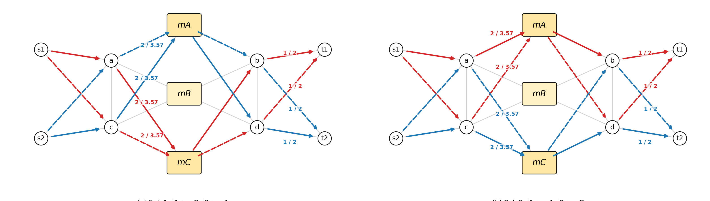

# 2026/7/9 讨论

> **任务安排：**
>
> 1. 针对小拓扑实验中 Gurobi 在相同 objective value 下可能只返回一个代表性最优解的问题，补充等价最优解输出功能。
> 1. 单层模型和双层模型近似比的问题


# 一、小拓扑实验中的等价最优解问题


在小拓扑实验中，求解器输出的 objective value 可能对应多个等价最优解。


## 1. 双层模型结果

在当前参数设置下，双层模型存在两组对称等价解。对应结果位于：

```text
toy_experiment/results/runs/047/equivalent_solutions.csv
```

两组等价解如下：

| solution_id | solver_mode | placement | CVaR | $U_{\mathrm{node}}^{\max}$ | $U_{\mathrm{link}}^{\max}$ | 总预留带宽 | Goodput |
| --- | --- | --- | ---: | ---: | ---: | ---: | ---: |
| 1 | two_layer_average_split | $i_1\to m_C,\ i_2\to m_A$ | 0.100 | 1.000 | 0.714 | 22.286 | 11.862 |
| 2 | two_layer_average_split | $i_1\to m_A,\ i_2\to m_C$ | 0.100 | 1.000 | 0.714 | 22.286 | 11.862 |

可以看到，两组方案在主要指标上完全一致，区别仅在于两个任务在 $m_A$ 与 $m_C$ 之间对称交换。这是拓扑结构的对称性导致的。




## 2. 单层模型结果

单层模型扫参实验，对应结果位于：

```text
toy_experiment/results/equivalence_scans/002/summary.csv
```

对单层模型CVaR约束进行扫参，结果如下：

| $\Gamma_L$ | status | placement | 等价解数量 | CVaR | $U_{\mathrm{node}}^{\max}$ | $U_{\mathrm{link}}^{\max}$ | 总预留带宽 | Goodput |
| --- | --- | --- | ---: | ---: | ---: | ---: | ---: | ---: |
| 0.1 | optimal | $i_1\to m_A,\ i_2\to m_C$ | 1 | 0.100 | 1.000 | 0.714 | 22.286 | 11.862 |
| 0.2 | optimal | $i_1\to m_A,\ i_2\to m_C$ | 1 | 0.200 | 1.000 | 0.471 | 17.429 | 11.658 |
| 0.3 | optimal | $i_1\to m_A,\ i_2\to m_B$ | 1 | 0.300 | 1.000 | 0.400 | 14.429 | 11.460 |
| 0.5 | optimal | $i_1\to m_A,\ i_2\to m_B$ | 1 | 0.500 | 1.000 | 0.400 | 12.000 | 11.052 |

从当前扫参结果看，单层模型在可行的 $\Gamma_L=0.1,0.2,0.3,0.5$ 下均只发现 1 个离散最优解；这说明在目前扫描范围内，单层模型暂未出现多个离散等价最优解。

但是当前扫参只覆盖了一组故障场景与有限的 $\Gamma_L$ 取值；当故障场景概率、任务需求、链路容量或候选路径集合发生变化时，单层模型理论上可存在等价解。


## 3. 代码修改

已在小拓扑求解代码中补充 solution pool 支持，使用方式：

在读取 `params.json` 时新增等价解相关参数：

```json
{
  "enumerate_equivalent_solutions": true,
  "solution_pool_limit": 50,
  "equivalent_obj_tol": 1e-6
}
```

其中：

- `enumerate_equivalent_solutions` 控制是否启用 solution pool；
- `solution_pool_limit` 控制最多保留多少个 pool 解；
- `equivalent_obj_tol` 控制判断 objective value 相同的容忍误差。


> [!CAUTION]
>
> 当前可以得到以下阶段性结论：
>
> 1. 当前小拓扑设置下，双层平均分流模型确实存在两组对称等价最优解。
> 2. 当前小拓扑设置下，单层模型暂时只发现一组最优解，但不能据此认为单层模型在所有参数下都不存在等价解。
>


# 二、任务2：单层模型和双层模型近似比的问题

## 1.目标

能否将单层模型看作原问题，将双层模型看作该原问题的一种近似算法，并进一步得到**理论近似比**。

分析框架如下：设单层模型的全局最优目标值为：

$$
OPT = F(y^*,x^*) ,
$$

其中 $(y^*,x^*)$ 表示单层模型同时优化任务放置和路径流量分配得到的最优解。双层模型先通过节点层平均分流代理模型得到任务放置 $\hat y$，再固定 $\hat y$ 求解链路层流量分配，得到：

$$
ALG = F(\hat y,\hat x) .
$$

若最终比较目标为资源利用率，例如：

$$
F(y,x)=\lambda U_{\mathrm{link}}^{\max}+(1-\lambda)U_{\mathrm{node}}^{\max},
$$

则可以定义双层模型相对于单层模型的经验近似比：

$$
\rho_{\mathrm{emp}}=\frac{ALG}{OPT},
$$

或相对最优性 gap：

$$
\mathrm{gap}=\frac{ALG-OPT}{OPT}.
$$

在双层模型最终解满足与单层模型相同真实 CVaR 约束的前提下，单层模型作为全局联合优化模型，应有 $ALG\ge OPT$，因此 $\rho_{\mathrm{emp}}\ge 1$。$\rho_{\mathrm{emp}}$ 越接近 1，说明双层模型越接近单层全局最优。


## 2. 疑问：理论近似比目前似乎不能直接得到

从当前模型结构看，双层模型暂时不能直接给出严格理论近似比。

直接原因如下：

1. 双层模型不是单层模型的严格等价分解，也不是标准的松弛-舍入算法；
2. 节点层使用平均分流代理模型选择放置方案，但最终评价目标是链路层重新优化后的真实目标；目前不能直接证明“代理模型选出的放置方案”与“真实目标下的最优放置方案”之间存在统一误差界；


## 3. 实验角度

从实验角度仍可得出经验近似比或相对最优性 gap，但不是理论近似比。也就是说，在单层模型可以求得全局最优的小规模实例上，计算：

$$
\rho_{\mathrm{emp}}=\frac{F_{\mathrm{two-layer}}}{F_{\mathrm{single}}},
\qquad
\mathrm{gap}=\frac{F_{\mathrm{two-layer}}-F_{\mathrm{single}}}{F_{\mathrm{single}}}.
$$
