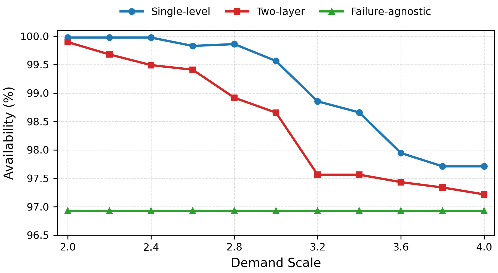
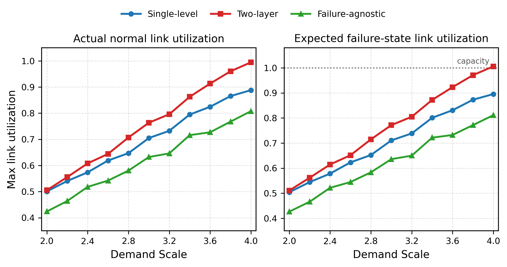
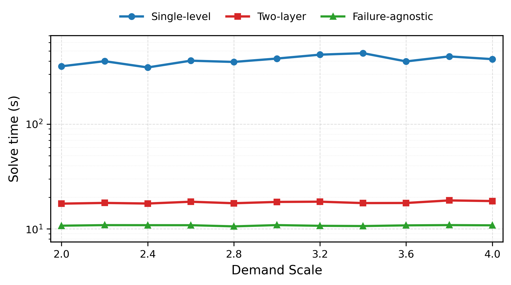

# 实验评估

---

## 一、实验设置

### A. 对比方法

| 方法 | 简称 | 说明 | 作用 |
| --- | --- | --- | --- |
| 单层联合优化模型 | Single-level | 同时优化任务放置、输入/输出流量分配、故障风险和资源利用率 | 作为完整联合优化基准 |
| 双层近似模型 | Two-layer | 上层生成候选任务放置方案，下层固定放置后逐个求解真实流量分配 | 验证分层近似能否接近单层模型，同时降低求解开销 |
| 无故障感知基准 | Failure-agnostic | 去掉故障风险目标，仅优化正常态资源利用率，再在相同故障场景下评价可用性 | 验证故障感知建模的必要性 |

### B. 主要指标说明

| 指标 | 含义 | 用于回答的问题 |
| --- | --- | --- |
| Availability | 故障后仍能完整满足任务需求的场景概率 | 故障感知优化是否提升服务可用性 |
| $U_{node}^{\max}$ | 最大计算节点利用率 | 任务放置是否造成计算资源瓶颈 |
| $U_{link,act}^{\max}$ | 无故障状态下真实业务流量形成的最大链路利用率 | 正常运行时网络压力如何 |
| $\mathbb{E}[U_{link}^{fail}]$ | 故障场景下最大链路利用率的期望值 | 平均故障状态下是否容易拥塞 |
| $\max_s U_{link}^{fail}(s)$ | 所有故障场景中的最坏链路利用率 | 极端故障状态下是否存在严重瓶颈 |
| Solve time | 模型求解时间 | 方法是否具有可扩展性和实用性 |

---

## 二、实验内容

> 主要关注三个问题：
>
> 1. 显式建模故障风险是否能够提高 Availability；
> 2. 双层近似模型是否能够接近单层联合优化模型；
> 3. 双层近似模型能否显著降低求解时间。
>

### 主要结果汇总

demand scale：2.0~4.0

| 方法 | 可用性 (%) | $U_{node}^{\max}$ | $U_{link,act}^{\max}$ | $\mathbb{E}[U_{link}^{fail}]$ | Solve time (s) |
| :-- | :--- | :--: | :--: | :--: | :--: |
| 单层模型 | 97.711–99.976 | 0.560–0.580 | 0.501–0.888 | 0.504–0.895 | 347.5–475.6 |
| 双层近似模型 | 97.217–99.896 | 0.560–0.560 | 0.505–0.994 | 0.511–1.006 | 17.4–18.7 |
| 无故障感知单层模型 | 96.926–96.926 | 0.560–0.660 | 0.424–0.808 | 0.426–0.811 | 10.6–10.9 |

**主要结论：**

- **单层模型的可用性最高**，在所有 demand scale 下均优于 Two-layer 和 Failure-agnostic，说明完整联合优化能够更充分地利用任务放置与流量分配之间的耦合关系。
- **Two-layer 与 Single-level 的 Availability 趋势一致**，平均差距约为 0.627 个百分点，但平均求解时间仅为 17.9 s，相比 Single-level 的 410.3 s 约有 22.9 倍加速。
- **无故障感知模型的链路利用率最低，但 Availability 最差**，说明仅优化正常态资源均衡不能保证故障场景下的服务可用性。
- 当 demand scale 接近 4.0 时，Two-layer 的故障态平均链路利用率达到 1.0059，说明链路资源已接近甚至略微超过容量边界，导致高负载下 Availability 的下降。

### （1）Availability 结果

这说明故障感知目标对提升服务可用性是必要的。Failure-agnostic 虽然在正常态下能够保持较低链路利用率，但由于没有显式优化故障场景下的任务损失，其故障后可用性明显低于另外两种故障感知方法。

### （2）链路利用率结果

正常态真实链路利用率和故障态平均链路利用率均随 demand scale 增大而上升。Two-layer 的链路利用率整体高于 Single-level。

Failure-agnostic 的链路利用率最低，但 Availability 并不高。这一现象说明，**低正常态链路利用率并不等价于高故障可用性**；如果路径和任务放置没有考虑故障概率与故障损失，仍可能在关键故障场景下出现服务不可用。

### 2.5 求解时间结果

求解时间结果表明，Single-level 的求解开销明显高于另外两种方法。Single-level 平均求解时间为 410.3 s，而 Two-layer 平均求解时间为 17.9 s，约实现 22.9 倍加速。Failure-agnostic 的平均求解时间最低，为 10.8 s，这是因为其不包含故障风险相关约束。

因此，Single-level 更适合作为小规模场景下的完整优化基准；Two-layer 虽然牺牲了一部分 Availability和资源均衡，但显著降低了求解时间，更适合作为后续扩展实验和实际部署的近似方法。

**总体来看，Single-level 提供性能上界，Two-layer 提供可扩展近似，Failure-agnostic 证明了故障感知建模的必要性。**

---

## 3. 原始数据

3.1 Availability 数据（%）

| Scale | Single-level | Two-layer | Failure-agnostic |
| --- | ---: | ---: | ---: |
| 2.0 | 99.976 | 99.896 | 96.926 |
| 2.2 | 99.976 | 99.679 | 96.926 |
| 2.4 | 99.976 | 99.492 | 96.926 |
| 2.6 | 99.829 | 99.410 | 96.926 |
| 2.8 | 99.861 | 98.917 | 96.926 |
| 3.0 | 99.564 | 98.655 | 96.926 |
| 3.2 | 98.854 | 97.564 | 96.926 |
| 3.4 | 98.659 | 97.564 | 96.926 |
| 3.6 | 97.945 | 97.433 | 96.926 |
| 3.8 | 97.711 | 97.339 | 96.926 |
| 4.0 | 97.711 | 97.217 | 96.926 |

3.2 正常态节点利用率数据

| Scale | Single-level | Two-layer | Failure-agnostic |
| --- | ---: | ---: | ---: |
| 2.0 | 0.5600 | 0.5600 | 0.5600 |
| 2.2 | 0.5600 | 0.5600 | 0.6000 |
| 2.4 | 0.5600 | 0.5600 | 0.6200 |
| 2.6 | 0.5600 | 0.5600 | 0.5800 |
| 2.8 | 0.5600 | 0.5600 | 0.5800 |
| 3.0 | 0.5600 | 0.5600 | 0.5800 |
| 3.2 | 0.5600 | 0.5600 | 0.5800 |
| 3.4 | 0.5600 | 0.5600 | 0.5800 |
| 3.6 | 0.5600 | 0.5600 | 0.6200 |
| 3.8 | 0.5800 | 0.5600 | 0.6200 |
| 4.0 | 0.5600 | 0.5600 | 0.6600 |

3.3 正常态真实链路利用率数据

| Scale | Single-level | Two-layer | Failure-agnostic |
| --- | ---: | ---: | ---: |
| 2.0 | 0.5006 | 0.5051 | 0.4238 |
| 2.2 | 0.5405 | 0.5554 | 0.4639 |
| 2.4 | 0.5737 | 0.6079 | 0.5180 |
| 2.6 | 0.6188 | 0.6441 | 0.5421 |
| 2.8 | 0.6469 | 0.7069 | 0.5803 |
| 3.0 | 0.7048 | 0.7633 | 0.6322 |
| 3.2 | 0.7323 | 0.7959 | 0.6461 |
| 3.4 | 0.7947 | 0.8626 | 0.7159 |
| 3.6 | 0.8243 | 0.9130 | 0.7268 |
| 3.8 | 0.8653 | 0.9601 | 0.7675 |
| 4.0 | 0.8879 | 0.9944 | 0.8076 |

3.4 正常态预分配链路利用率数据

| Scale | Single-level | Two-layer | Failure-agnostic |
| --- | ---: | ---: | ---: |
| 2.0 | 0.5022 | 0.5110 | 0.4238 |
| 2.2 | 0.5423 | 0.5614 | 0.4639 |
| 2.4 | 0.5780 | 0.6125 | 0.5180 |
| 2.6 | 0.6369 | 0.6557 | 0.5421 |
| 2.8 | 0.6688 | 0.7146 | 0.5803 |
| 3.0 | 0.7101 | 0.7656 | 0.6322 |
| 3.2 | 0.7410 | 0.8008 | 0.6461 |
| 3.4 | 0.8046 | 0.8677 | 0.7159 |
| 3.6 | 0.8303 | 0.9187 | 0.7268 |
| 3.8 | 0.8685 | 0.9698 | 0.7675 |
| 4.0 | 0.8900 | 1.0000 | 0.8076 |

3.5 故障态平均链路利用率数据

| Scale | Single-level | Two-layer | Failure-agnostic |
| --- | ---: | ---: | ---: |
| 2.0 | 0.5038 | 0.5106 | 0.4264 |
| 2.2 | 0.5443 | 0.5616 | 0.4659 |
| 2.4 | 0.5782 | 0.6145 | 0.5215 |
| 2.6 | 0.6230 | 0.6515 | 0.5445 |
| 2.8 | 0.6522 | 0.7148 | 0.5833 |
| 3.0 | 0.7106 | 0.7714 | 0.6358 |
| 3.2 | 0.7385 | 0.8049 | 0.6498 |
| 3.4 | 0.8007 | 0.8720 | 0.7216 |
| 3.6 | 0.8309 | 0.9229 | 0.7322 |
| 3.8 | 0.8727 | 0.9708 | 0.7716 |
| 4.0 | 0.8955 | 1.0059 | 0.8112 |

3.6 故障态最坏链路利用率数据

| Scale | Single-level | Two-layer | Failure-agnostic |
| --- | ---: | ---: | ---: |
| 2.0 | 0.7045 | 0.9844 | 0.7796 |
| 2.2 | 0.7905 | 1.0828 | 0.6996 |
| 2.4 | 0.8977 | 1.1813 | 0.8231 |
| 2.6 | 1.0518 | 1.2702 | 0.8157 |
| 2.8 | 1.0776 | 1.3781 | 1.1020 |
| 3.0 | 1.1536 | 1.4766 | 0.9447 |
| 3.2 | 1.1925 | 1.5633 | 0.9506 |
| 3.4 | 1.2898 | 1.6735 | 1.2272 |
| 3.6 | 1.3190 | 1.7719 | 1.1749 |
| 3.8 | 1.5824 | 1.8703 | 1.3957 |
| 4.0 | 1.3879 | 1.9688 | 1.6147 |

3.7 求解时间数据（s）

| Scale | Single-level | Two-layer | Failure-agnostic |
| --- | ---: | ---: | ---: |
| 2.0 | 356.6 | 17.4 | 10.7 |
| 2.2 | 398.8 | 17.7 | 10.9 |
| 2.4 | 347.5 | 17.5 | 10.9 |
| 2.6 | 403.2 | 18.2 | 10.9 |
| 2.8 | 392.3 | 17.6 | 10.6 |
| 3.0 | 422.5 | 18.1 | 10.9 |
| 3.2 | 460.2 | 18.2 | 10.7 |
| 3.4 | 475.6 | 17.6 | 10.7 |
| 3.6 | 396.7 | 17.7 | 10.8 |
| 3.8 | 442.8 | 18.7 | 10.9 |
| 4.0 | 417.2 | 18.5 | 10.8 |

---

## 4. 后续待扩展

| 扩展内容 |
| --- |
| 更换 IBM / ATT / MWAN 拓扑 |
| 增加 ECMP / MaxMin  baseline 算法 |
| 改变 $\rho$、$\lambda$、$\beta$ |
| 改变任务数量或故障场景数量，增大实验规模 |

